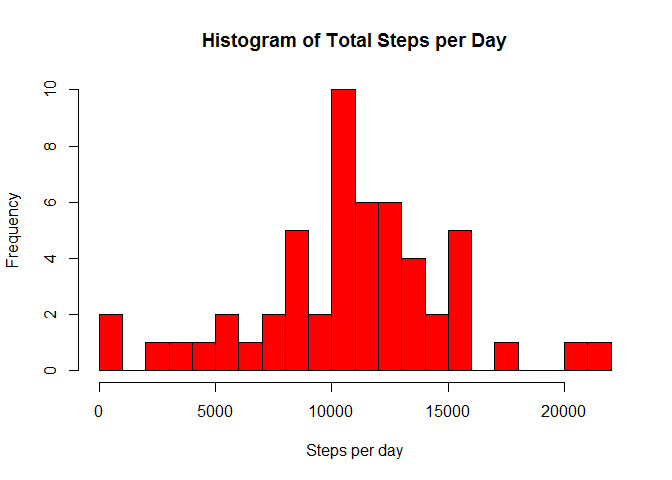
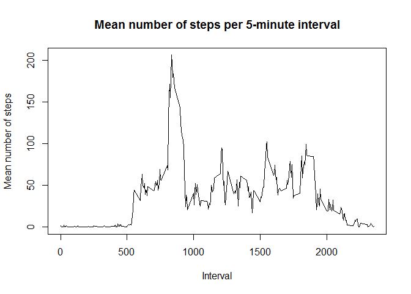
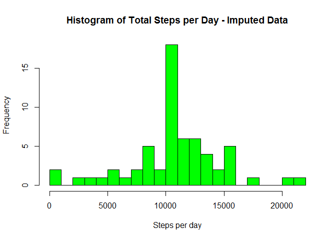
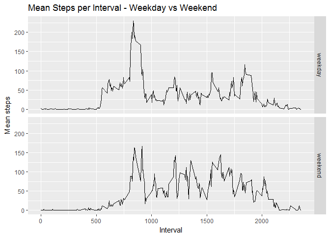

# Reproducible Research: Peer Assessment 1


## Loading and preprocessing the data
For the first step of the analysis, we first load the data (which is stored in the working directory)
and then properly format the date field to the Date class.


```r
## read the activity data file
actData <- read.csv("activity.csv", na.strings = "NA")
## format the date field
actData$date <- as.Date(actData$date, "%Y-%m-%d")
```


## What is mean total number of steps taken per day?
In the next step of the analysis, we want to look at the mean of the total number of steps taken per day.
(NA/missing values are ignored for this step.)

We first create a data frame with the sum of steps for each day.

```r
## sum steps for each day, default is to ignore NAs, which is desired
stepsByDate <- aggregate(steps~date, data = actData, sum)
```

Then we plot a histogram of values of total steps per day.

```r
hist(stepsByDate$steps, breaks = 20, xlab = "Steps per day", main = "Histogram of Total Steps per Day", col = "red")
```

<!-- -->

We then calculate the mean and median of the total steps per day.

```r
meanSteps <- mean(stepsByDate$steps, na.rm = TRUE)
medSteps <- median(stepsByDate$steps, na.rm = TRUE)
```
This results in a mean of 1.0766189\times 10^{4} and a median of 10765.

## What is the average daily activity pattern?
In this step of the analysis, we want to look at the pattern of the average daily activity.  We first take the
mean of the number of steps that occurs during each 5-minute interval of the day. (Again, NAs are ignored.)

```r
meanStepsPerInterval <- aggregate(steps~interval, data = actData, mean)
```

Next we plot a time-series to see how the average number of steps changes across the 5-minute intervals of the day.

```r
plot(meanStepsPerInterval$interval, meanStepsPerInterval$steps, type = "l", ylab = "Mean number of steps", xlab =  "Interval", main = "Mean number of steps per 5-minute interval")
```

<!-- -->

We then want to find the interval with the highest mean of steps.

```r
## We want the first column, as that is where the interval is stored
maxMeanInterval <- meanStepsPerInterval[which.max(meanStepsPerInterval$steps), 1]
```
This results in the 835 interval as having the maximum mean of steps, averaged over all days.

## Imputing missing values
In the next step of the analysis, we want to explore the missing values in the data set and re-analyze the data
after imputing the missing values.

First, we want to see how many rows contain an NA value (i.e. are not complete cases).

```r
countMissing <- sum(!complete.cases(actData))
```
This results in **2304** rows with missing data.

Next we want to impute the missing values.  For my analysis, I am replacing each missing value with the mean
for that time interval (based on the meanStepsPerInterval data frame created earlier).


```r
## create a copy of the activity data set to hold the new imputed values
impActData <- actData
##  loop through the data, replacing any missing values with the mean for that interval
## count the number of replacements made to ensure it matches the number of incomplete cases found
count <- 0
intv <- 0
for (i in 1:nrow(impActData)){
    if (is.na(impActData[i, 1])){ ##if steps value is missing
        intv <- impActData[i, 3]  ## get the interval value
        impActData[i, 1] <- subset(meanStepsPerInterval, interval == intv)$steps  ## lookup the mean for that interval and assign it
        count <- count + 1
    }
}
```

The total number of replaced missing values was **2304**.

Now we wish to re-run our previous analysis of the sum of steps per day using the new data set with imputed data.


```r
## sum steps for each day, default is to ignore NAs, which is desired
impStepsByDate <- aggregate(steps~date, data = impActData, sum)
```

We re-plot the histogram using the imputed data set.

```r
hist(impStepsByDate$steps, breaks = 20, xlab = "Steps per day", main = "Histogram of Total Steps per Day - Imputed Data", col = "green")
```

<!-- -->

We also recalculate the mean and median of the total steps per day with the imputed data.

```r
impMeanSteps <- mean(impStepsByDate$steps, na.rm = TRUE)
impMedSteps <- median(impStepsByDate$steps, na.rm = TRUE)
```
This results in a mean of 1.0766189\times 10^{4} and a median of 1.0766189\times 10^{4}.

There was basically no effect on the analysis outcome when the missing values were imputed.
The mean and median are virtually the same.  This is expected, as we've just replaced missing values with values from
an average day.


## Are there differences in activity patterns between weekdays and weekends?
Finally, we want to compare activity patterns between weekdays and weekends.

First, we'll create a new factor variable in our (imputed) data set to differentiate weekdays from weekends.


```r
## intially set all rows to weekday
impActData$dayFactor <- factor(rep("weekday", nrow(impActData)), levels = c("weekday", "weekend"))
## then update the rows for weekend data
impActData$dayFactor[weekdays(impActData$date) %in% c("Saturday", "Sunday")] <- "weekend"
## group the data by interval and dayFactor as prep for the mean calculation
library(dplyr)
grouped <- group_by(impActData, interval, dayFactor)
intFactorMeans <- summarise(grouped, meanStep = mean(steps))
```

We then plot the mean steps by interval for weekdays and weekends.

```r
library(ggplot2)
qplot(interval, meanStep, data = intFactorMeans, facets = dayFactor~., geom = "line", xlab = "Interval", ylab = "Mean steps", main = "Mean Steps per Interval - Weekday vs Weekend")
```

<!-- -->

We notice 2 major differences:

1. Mean steps begin to increase earlier on weekdays than on Weekends, which likely
corresponds to the common pattern of being awake and active fairly early for work on weekdays
and sleeping later (and not being as immediately active) on the weekend.

2. On weekdays, there is a large spike in mean steps between 8 and 9 am (which 
corresponds to the average work commute), and activity is much lower for the rest
of the day.  On weekends, mean steps are much more evenly distributed throughout
the day.
